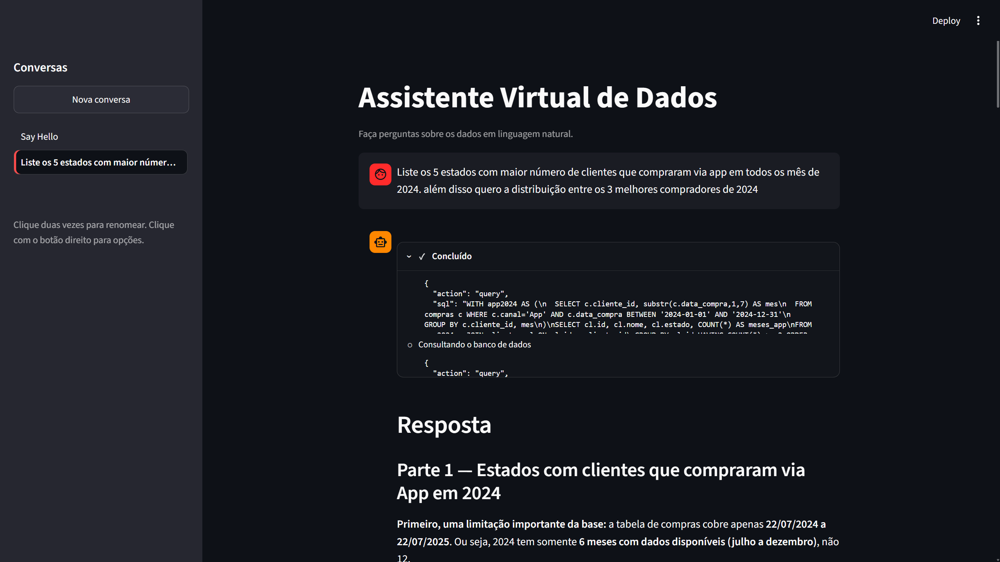
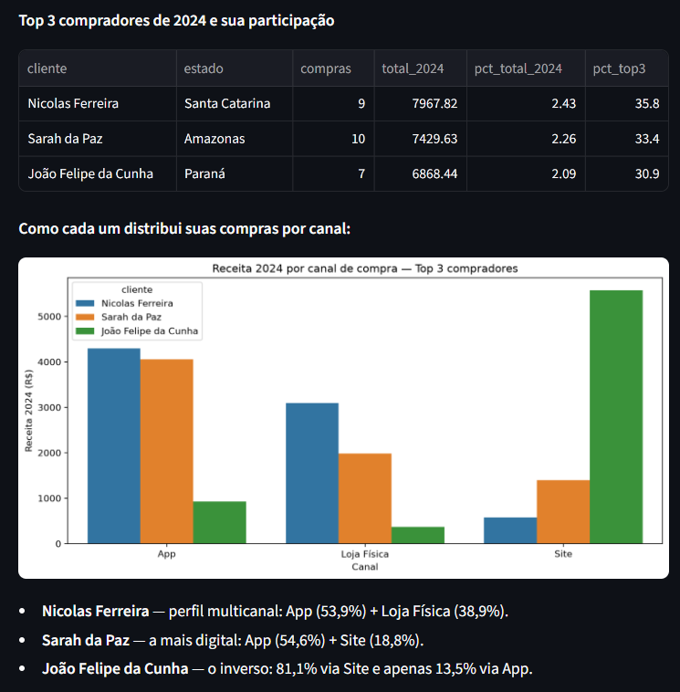
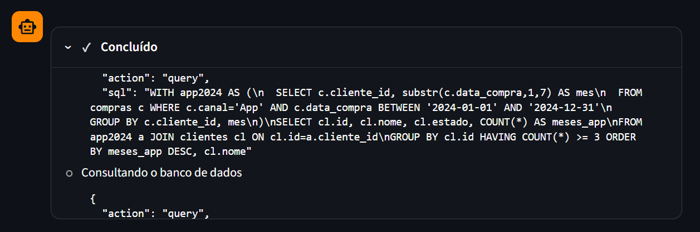
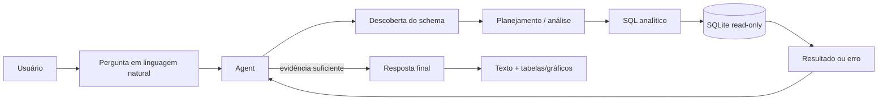
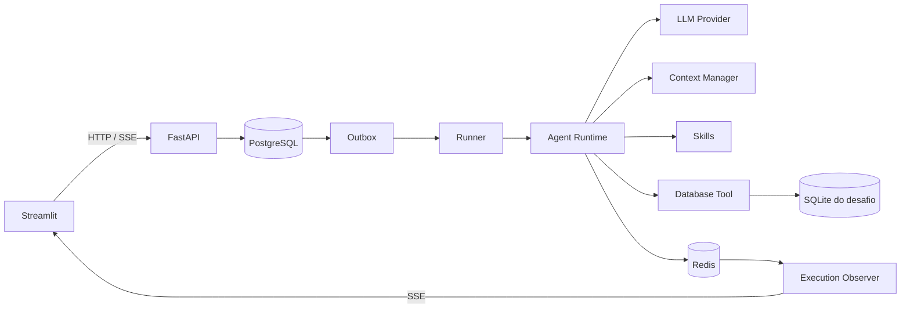

# Desafio Franq — Assistente Virtual de Dados

Implementação do **Desafio Técnico 1 da Franq**: um assistente de dados capaz de investigar autonomamente um banco SQLite, descobrir o schema em tempo de execução, executar múltiplas consultas, se recuperar de falhas e responder perguntas de negócio com rastreabilidade e visualizações inline.

<p align="center">
  
</p>

## O que foi implementado

- **Agent autônomo com LangGraph** para decompor perguntas e iterar entre análise, Skills e Tools.
- **Descoberta dinâmica do schema SQLite**, sem depender de tabelas ou colunas hardcoded no prompt.
- **Database Tool read-only** com validação de SQL, timeout, limite de linhas e conexão somente leitura.
- **Recuperação de falhas durante a investigação**: erros de Tool retornam ao Agent como observação e podem gerar uma nova tentativa.
- **Visualizações inline geradas pelo próprio Agent**, com suporte a tabela, barras, linha e dispersão.
- **Execução durável e desacoplada da conexão do cliente** com PostgreSQL, Outbox e Runner independente.
- **Streaming e reattach via SSE/Redis**: refresh ou perda da conexão não reinicia a execução.
- **Rastreabilidade das operações observáveis**, incluindo iterações, chamadas de Tool, SQL e eventos da execução.
- **Histórico de conversas, cancelamento, migrations Alembic e CI automatizado**.

## Demonstração

A interface é implementada em Streamlit e consome somente a API pública do sistema. O usuário envia uma pergunta em linguagem natural e acompanha as operações observáveis realizadas durante a investigação.

### Resposta analítica com tabela e gráfico

<p align="center">
  
</p>

O Agent pode combinar múltiplas consultas e apresentar diferentes perspectivas dentro da mesma resposta. A visualização é escolhida somente quando melhora materialmente a comunicação; os cálculos de negócio continuam sendo feitos durante a investigação, e não pelo renderer.

### Execução transparente

<p align="center">
  
</p>

O painel não expõe chain-of-thought. Ele mostra **ações verificáveis da execução**: fases, Tools utilizadas, argumentos, consultas SQL, sucessos, falhas e transições relevantes.

## Como o Agent investiga os dados



O runtime é iterativo. Uma única pergunta pode exigir inspeção de schema, várias consultas independentes ou dependentes, correção de SQL e consolidação dos resultados antes da resposta final.

## Arquitetura resumida



**PostgreSQL** mantém o estado durável da aplicação. **Redis** mantém hot state e o stream realtime. O banco SQLite fornecido pelo desafio é tratado como dado externo e é montado somente no Runner, em modo read-only.

A documentação detalhada das decisões, ownership de dados, fluxo de execução, Context Manager, Observer, Outbox, Runner, LLM providers e tratamento de falhas está em **[docs/architecture.md](docs/architecture.md)**.

## Estrutura do repositório

```text
├── packages/
│   ├── core/
│   │   ├── alembic.ini
│   │   ├── migrations/
│   │   ├── pyproject.toml
│   │   └── src/package/agent/
│   ├── api/
│   │   ├── pyproject.toml
│   │   └── src/package/api/
│   ├── runner/
│   │   ├── pyproject.toml
│   │   └── src/package/runner/
│   └── ui/
│       ├── pyproject.toml
│       └── src/package/ui/
├── docker/
│   └── images/app/
│       └── Dockerfile
├── data/
│   └── challenge-1/anexo_desafio_1.db
├── docs/
│   ├── architecture.md
│   ├── challenge.pdf
│   └── images/
├── tests/
├── compose.yaml
├── pyproject.toml
└── README.md
```

Cada diretório em `packages/` representa um boundary executável ou distribuível claro:

- `packages/core`: runtime do Agent, contexto, Skills, Tools, Observer, trace, persistência e migrations;
- `packages/api`: composition root HTTP/SSE;
- `packages/runner`: consumer independente responsável pela execução do Agent;
- `packages/ui`: interface Streamlit, que consome somente a API pública.

## Runtime do Agent

O `LangGraphAgentProgram` executa, de forma simplificada, o seguinte ciclo:

```text
Agent
  |
  v
Reasoning / LLM
  |
  +----------> Tool ----------+
  |                            |
  +----------> Skill ----------+--> Agent
  |                            |
  +----------> Answer ------------> Client
```

Uma Tool pode ser chamada várias vezes durante a mesma execução. Erros retornam para o Agent como observações, permitindo ajustar a estratégia e tentar novamente. Chamadas independentes podem executar em paralelo até o limite configurado.

A execução termina quando o modelo conclui a resposta ou quando o limite de iterações é atingido.

## Visualizações inline

A resposta final pode intercalar texto com até múltiplas visualizações estruturadas. São suportados:

- `table` para leitura precisa de valores e rankings;
- `bar` para comparação entre categorias;
- `line` para evolução temporal ou sequências ordenadas;
- `scatter` para relação entre duas medidas numéricas.

O Agent decide quando uma visualização agrega valor. Os dados enviados ao renderer já devem estar no grão analítico final: contagens, médias, agregações e regras de negócio pertencem à investigação/SQL.

## LLM

O Agent depende da abstração `LLMClient`. Os providers concretos usam LangChain:

- `openai`: `OpenAILLM` baseado em `ChatOpenAI`;
- `deepseek`: `DeepSeekLLM` baseado em `ChatDeepSeek`.

O provider ativo é selecionado por `LLM_PROVIDER=openai` ou `LLM_PROVIDER=deepseek`.

## Execução local com Docker Compose

Copie as variáveis de ambiente:

```bash
cp .env.example .env
```

Configure um provider, por exemplo:

```env
LLM_PROVIDER=openai
OPENAI_API_KEY=sua-chave
```

Suba o stack:

```bash
docker compose up --build
```

A interface fica disponível em:

- Streamlit: `http://localhost:8501`
- API: `http://localhost:8000`

O Runner pode ser escalado independentemente:

```bash
docker compose up --build --scale runner=2
```

Para encerrar:

```bash
docker compose down
```

Para remover também o volume PostgreSQL:

```bash
docker compose down -v
```

## Execução sem containers

Instale as dependências do projeto e os packages locais:

```bash
pip install -e ".[dev]"
pip install --no-deps \
  -e packages/core \
  -e packages/api \
  -e packages/runner \
  -e packages/ui
```

Depois execute migrations, API, Runner e UI em processos separados:

```bash
cd packages/core && alembic upgrade head && cd ../..
uvicorn package.api.http.app:app --reload
python -m package.runner.main
streamlit run packages/ui/src/package/ui/app.py
```

## Exemplos de consultas testadas

Os cenários abaixo exercitam diferentes capacidades do Agent:

| Exemplo | O que valida |
| --- | --- |
| `Liste os 5 estados com maior número de clientes que compraram via App em 2024 e mostre também a distribuição entre os 3 melhores compradores de 2024.` | decomposição em múltiplas etapas, agregações, ranking, múltiplas consultas e visualização |
| `Quais categorias de produto tiveram maior participação nas compras?` | descoberta de schema, agregação e comparação categórica |
| `Me fale qual cliente menos comprou no período e contextualize o resultado.` | ordenação, interpretação de granularidade e resposta analítica |
| consultas que exigem schema ainda desconhecido | uso de `inspect_schema` antes da geração de SQL |
| consultas com SQL inicialmente inválida durante a investigação | retorno do erro à execução e possibilidade de autocorreção pelo Agent |

Como o sistema é agentic, a sequência exata de Tools pode variar entre modelos e execuções; o contrato importante é que os resultados sejam sustentados pelos dados efetivamente consultados.

## Testes e CI

Execute a suíte localmente com:

```bash
pytest
```

Os testes concorrentes contra PostgreSQL podem ser habilitados com:

```bash
RUN_POSTGRES_INTEGRATION_TESTS=1 pytest tests/test_context_repository_concurrency.py
```

O workflow `.github/workflows/tests.yml` valida:

- configuração do Docker Compose;
- build da imagem da aplicação;
- migrations em banco novo e idempotência;
- drift entre models e migrations com `alembic check`;
- testes PostgreSQL;
- testes de UI/browser;
- suíte Python completa.

## Decisões e trade-offs

O desafio poderia ser implementado como uma única requisição HTTP síncrona. Esta solução separa **aceitação**, **execução** e **observação** para que a vida da execução não dependa da conexão do navegador.

Isso adiciona PostgreSQL, Redis, Outbox e um Runner independente, mas entrega propriedades concretas: persistência da execução antes do processamento, reattach após refresh, streaming desacoplado, cancelamento e possibilidade de escalar workers sem duplicar a API.

A complexidade adicional está concentrada em boundaries explícitos; o fluxo principal do Agent continua independente desses detalhes de transporte e persistência.

## Melhorias e extensões

Possíveis evoluções, fora do escopo necessário para o desafio:

- avaliação automatizada da qualidade das respostas contra um conjunto de perguntas de negócio;
- métricas de custo, latência e token usage por execução;
- estratégias adicionais de recuperação de contexto;
- suporte a novas Tools e outras fontes de dados além de SQLite;
- autenticação e isolamento multi-tenant;
- observabilidade distribuída com tracing externo;
- filas especializadas para cargas maiores ou distribuição entre múltiplos nós.

## Documentação

- **[Arquitetura detalhada](docs/architecture.md)**
- **[Enunciado do desafio](docs/challenge.pdf)**
