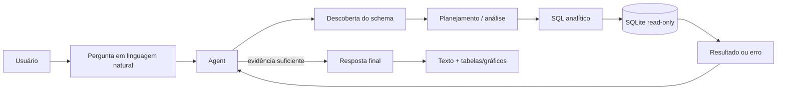
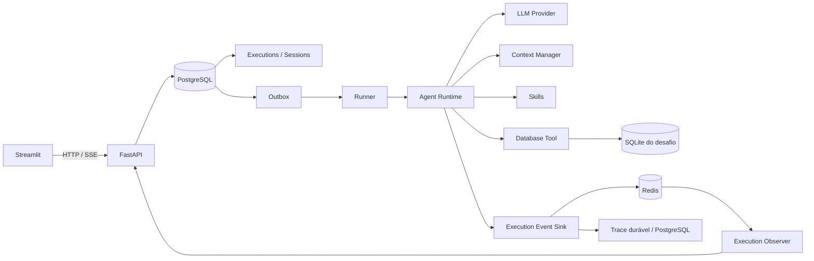

# Desafio Franq — Assistente Virtual de Dados

Implementação do **Desafio Técnico 1 da Franq**: um assistente de dados capaz de investigar autonomamente um banco SQLite, descobrir o schema em tempo de execução, executar múltiplas consultas, se recuperar de falhas e responder perguntas de negócio com rastreabilidade e visualizações inline.

<p align="center">
  
</p>

## O que foi implementado

- **Agent autônomo com LangGraph** para decompor perguntas e iterar entre análise, Skills e Tools.
- **Descoberta dinâmica do schema SQLite**, sem depender de tabelas ou colunas hardcoded no prompt.
- **Database Tool read-only** com validação de SQL, timeout, limite de linhas e conexão somente leitura.
- **Recuperação de falhas durante a investigação**: erros de Tool retornam ao Agent como observação e podem gerar uma nova tentativa.
- **Visualizações inline geradas pelo próprio Agent**, com suporte a tabela, barras, linha e dispersão.
- **Execution registrada de forma durável e processada de forma assíncrona**, desacoplada da conexão do cliente, com PostgreSQL, Outbox e Runner independente.
- **Streaming e reattach via SSE/Redis**: refresh ou perda da conexão não reinicia a execução.
- **Rastreabilidade das operações observáveis**, incluindo iterações, chamadas de Tool, SQL e eventos da execução.
- **Histórico de conversas, cancelamento, migrations Alembic e CI automatizado**.

## Demonstração

A interface é implementada em Streamlit e consome somente a API pública do sistema. O usuário envia uma pergunta em linguagem natural e acompanha as operações observáveis realizadas durante a investigação.

### Resposta analítica com tabela e gráfico

<p align="center">
  
</p>

O Agent pode combinar múltiplas consultas e apresentar diferentes perspectivas dentro da mesma resposta. O Agent é instruído a utilizar visualizações somente quando elas melhoram materialmente a comunicação; os cálculos de negócio continuam sendo feitos durante a investigação, e não pelo renderer.

### Execução transparente

<p align="center">
  
</p>

O painel não expõe chain-of-thought. Ele mostra **ações verificáveis da execução**: fases, Tools utilizadas, argumentos, consultas SQL, sucessos, falhas e transições relevantes.

## Como o Agent investiga os dados

Uma investigação típica pode seguir o fluxo abaixo. A sequência exata não é fixa: o runtime é iterativo e o Agent pode escolher Skills, Tools e novas consultas conforme as evidências obtidas em cada etapa.



O runtime é iterativo. Uma única pergunta pode exigir inspeção de schema, várias consultas independentes ou dependentes, correção de SQL e consolidação dos resultados antes da resposta final.

## Arquitetura resumida



**PostgreSQL** mantém o estado durável da aplicação, incluindo Sessions, Executions, Outbox e trace. A Outbox faz parte do próprio banco e permite aceitar a Execution e registrar o trabalho a ser processado na mesma transação. **Redis** mantém hot state e o stream realtime. O banco SQLite fornecido pelo desafio é tratado como dado externo e é montado somente no Runner, em modo read-only.

A documentação detalhada das decisões, ownership de dados, fluxo de execução, Context Manager, Observer, Outbox, Runner, LLM providers e tratamento de falhas está em **[docs/architecture.md](docs/architecture.md)**.

## Estrutura do repositório

```text
├── packages/
│   ├── core/
│   │   ├── alembic.ini
│   │   ├── migrations/
│   │   ├── pyproject.toml
│   │   └── src/package/agent/
│   ├── api/
│   │   ├── pyproject.toml
│   │   └── src/package/api/
│   ├── runner/
│   │   ├── pyproject.toml
│   │   └── src/package/runner/
│   └── ui/
│       ├── pyproject.toml
│       └── src/package/ui/
├── docker/
│   └── images/app/
│       └── Dockerfile
├── data/
│   └── challenge-1/anexo_desafio_1.db
├── docs/
│   ├── architecture.md
│   ├── challenge.pdf
│   └── images/
├── tests/
├── compose.yaml
├── pyproject.toml
└── README.md
```

Cada diretório em `packages/` representa um boundary executável ou distribuível claro:

- `packages/core`: runtime do Agent, contexto, Skills, Tools, Observer, trace, persistência e migrations;
- `packages/api`: composition root HTTP/SSE;
- `packages/runner`: consumer independente responsável pela execução do Agent;
- `packages/ui`: interface Streamlit, que consome somente a API pública.

## Runtime do Agent

O `LangGraphAgentProgram` executa, de forma simplificada, o seguinte ciclo:

```text
Agent
  |
  v
Reasoning / LLM
  |
  +----------> Tool ----------+
  |                            |
  +----------> Skill ----------+--> Agent
  |                            |
  +----------> Answer ------------> Client
```

Uma Tool pode ser chamada várias vezes durante a mesma execução. Erros retornam para o Agent como observações, permitindo ajustar a estratégia e tentar novamente. Chamadas independentes podem executar em paralelo até o limite configurado.

A execução termina quando o modelo conclui a resposta ou quando o limite de iterações é atingido.

## Visualizações inline

A resposta final pode intercalar texto com múltiplas visualizações estruturadas. São suportados:

- `table` para leitura precisa de valores e rankings;
- `bar` para comparação entre categorias;
- `line` para evolução temporal ou sequências ordenadas;
- `scatter` para relação entre duas medidas numéricas.

O Agent é instruído a usar uma visualização quando ela agrega valor. Os dados enviados ao renderer já devem estar no grão analítico final: contagens, médias, agregações e regras de negócio pertencem à investigação/SQL.

## LLM

O Agent depende da abstração `LLMClient`. Os providers concretos usam LangChain:

- `openai`: `OpenAILLM` baseado em `ChatOpenAI`;
- `deepseek`: `DeepSeekLLM` baseado em `ChatDeepSeek`.

O provider ativo é selecionado por `LLM_PROVIDER=openai` ou `LLM_PROVIDER=deepseek`.

## Execução local com Docker Compose

O Docker Compose é o caminho recomendado para executar o projeto completo localmente.

Copie as variáveis de ambiente:

```bash
cp .env.example .env
```

Configure um provider, por exemplo:

```env
LLM_PROVIDER=deepseek
DEEPSEEK_API_KEY=sua-chave
```

Suba o stack:

```bash
docker compose up --build
```

A interface fica disponível em:

- Streamlit: `http://localhost:8501`
- API: `http://localhost:8000`

O Runner pode ser escalado independentemente:

```bash
docker compose up --build --scale runner=2
```

Para encerrar:

```bash
docker compose down
```

Para remover também o volume PostgreSQL:

```bash
docker compose down -v
```

## Execução sem containers

Para executar os processos Python diretamente no host, são necessários **Python 3.14+**, **PostgreSQL**, **Redis** e um arquivo `.env` configurado com endpoints e credenciais compatíveis com o ambiente local.

Instale as dependências do projeto e os packages locais:

```bash
pip install -e ".[dev]"
pip install --no-deps \
  -e packages/core \
  -e packages/api \
  -e packages/runner \
  -e packages/ui
```

Depois execute migrations, API, Runner e UI em processos separados:

```bash
cd packages/core && alembic upgrade head && cd ../..
uvicorn package.api.http.app:app --reload
python -m package.runner.main
streamlit run packages/ui/src/package/ui/app.py
```

## Exemplos de consultas testadas

As perguntas do próprio desafio foram usadas como referência principal para validar as capacidades do Agent:

| Exemplo | O que valida |
| --- | --- |
| `Liste os 5 estados com maior número de clientes que compraram via app em maio.` | descoberta de schema, relacionamento entre clientes e compras, filtro temporal, canal, contagem distinta e ranking |
| `Quantos clientes interagiram com campanhas de WhatsApp em 2024?` | descoberta de schema, filtros temporais e categóricos e contagem de clientes |
| `Quais categorias de produto tiveram o maior número de compras em média por cliente?` | agregação em múltiplas granularidades e comparação entre categorias |
| `Qual o número de reclamações não resolvidas por canal?` | filtros combinados, agrupamento por canal e comparação de resultados |
| `Qual a tendência de reclamações por canal no último ano?` | série temporal, agregação por período e canal e visualização de linha |
| `Liste os 5 estados com maior número de clientes que compraram via App em 2024 e mostre também a distribuição entre os 3 melhores compradores de 2024.` | cenário adicional de stress para decomposição em múltiplas etapas, múltiplas consultas, ranking e visualização |

Também são cobertos cenários em que o schema ainda não foi inspecionado e situações em que uma Tool retorna erro durante a investigação, permitindo ao Agent incorporar essa observação e ajustar a próxima tentativa.

Como o sistema é agentic, a sequência exata de Tools pode variar entre modelos e execuções; o contrato importante é que os resultados sejam sustentados pelos dados efetivamente consultados.

## Testes e CI

Execute a suíte localmente com:

```bash
pytest
```

Os testes concorrentes contra PostgreSQL podem ser habilitados com:

```bash
RUN_POSTGRES_INTEGRATION_TESTS=1 pytest tests/test_context_repository_concurrency.py
```

O workflow `.github/workflows/tests.yml` valida:

- configuração do Docker Compose;
- build da imagem da aplicação;
- migrations em banco novo e idempotência;
- drift entre models e migrations com `alembic check`;
- testes PostgreSQL;
- testes de UI/browser;
- suíte Python completa.

## Decisões e trade-offs

O desafio poderia ser implementado como uma única requisição HTTP síncrona. Esta solução separa **aceitação**, **execução** e **observação** para que a vida da execução não dependa da conexão do navegador.

Isso adiciona PostgreSQL, Redis, Outbox e um Runner independente, mas entrega propriedades concretas: persistência da Execution antes do processamento, reattach após refresh, streaming desacoplado, cancelamento e possibilidade de escalar workers sem duplicar a API.

A complexidade adicional está concentrada em boundaries explícitos; o fluxo principal do Agent continua independente desses detalhes de transporte e persistência.

## Melhorias e extensões

Possíveis evoluções, fora do escopo necessário para o desafio:

- avaliação automatizada da qualidade das respostas contra um conjunto de perguntas de negócio;
- métricas de custo, latência e token usage por execução;
- estratégias adicionais de recuperação de contexto;
- suporte a novas Tools e outras fontes de dados além de SQLite;
- autenticação e isolamento multi-tenant;
- observabilidade distribuída com tracing externo;
- filas especializadas para cargas maiores ou distribuição entre múltiplos nós;
- introduzir um **journal durável e completo da execução associado a checkpoints do estado do Agent**. Atualmente, eventos observáveis selecionados já são persistidos incrementalmente no trace, enquanto Redis mantém hot state e o stream realtime. Uma evolução seria persistir informação suficiente para reconstruir o estado operacional do runtime e permitir que uma Execution interrompida por falha de processo fosse retomada a partir de um checkpoint seguro;
- disponibilizar as **Tools atualmente implementadas localmente por meio de um servidor MCP**. O runtime já depende de contratos e de um `ToolRegistry`, portanto essa evolução não teria como objetivo desacoplar Tools do Agent — essa separação já existe —, mas desacoplar também sua implementação e deployment, permitindo descoberta e integração de capacidades externas por um protocolo padronizado.

## Documentação

- **[Arquitetura detalhada](docs/architecture.md)**
- **[Enunciado do desafio](docs/challenge.pdf)**
