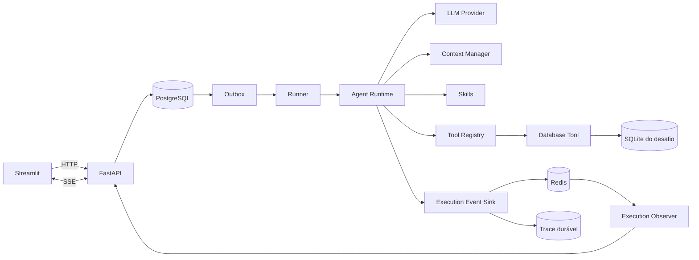
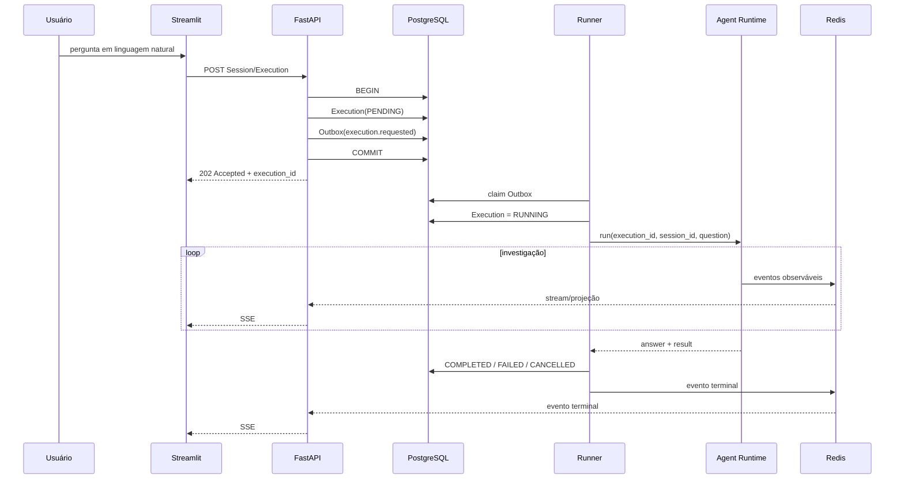
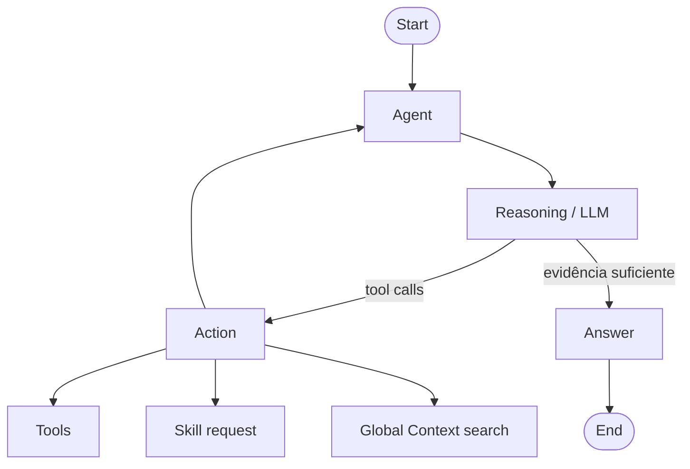
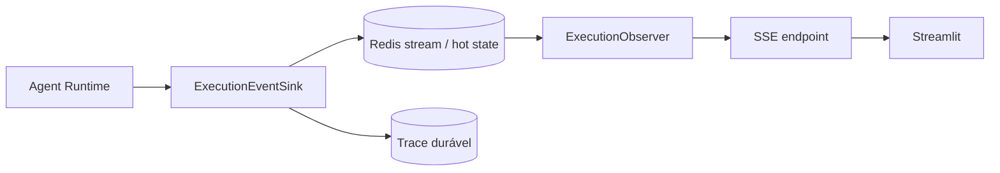

# Arquitetura

Este documento descreve a arquitetura da implementação do Desafio Técnico 1 da Franq. O objetivo do sistema é responder perguntas de negócio sobre o banco SQLite fornecido no desafio por meio de um Agent capaz de investigar dados de forma iterativa, executar múltiplas operações, se recuperar de falhas e produzir respostas rastreáveis sem acoplar a vida da execução à conexão do navegador.

## 1. Objetivos arquiteturais

A solução foi organizada em torno de alguns invariantes:

1. **A execução deve sobreviver à conexão do cliente.** Um refresh, timeout HTTP ou perda de SSE não deve reiniciar nem cancelar automaticamente uma investigação em andamento.
2. **Acceptance e Execution são responsabilidades diferentes.** A API aceita e persiste o trabalho; um Runner separado o executa.
3. **O banco do desafio é dado externo e somente leitura.** O runtime pode inspecionar e consultar o SQLite, mas não modificá-lo.
4. **O Agent não conhece o schema previamente.** Tabelas e colunas devem ser descobertas por Tool durante a execução.
5. **Falhas de Tool são observações, não necessariamente falhas da Execution.** Um SQL inválido pode voltar ao Agent para correção.
6. **A interface mostra fatos observáveis da execução, não chain-of-thought.** Queries, Tools, fases e resultados operacionais são rastreáveis; raciocínio interno do modelo não é exposto.
7. **Dados duráveis e estado realtime possuem responsabilidades distintas.** PostgreSQL é a fonte durável; Redis sustenta hot state e streaming.

## 2. Boundaries do repositório

```text
packages/
├── core/     # Agent runtime, persistência, migrations e contratos compartilhados
├── api/      # composition root HTTP/SSE
├── runner/   # consumer independente responsável por executar o Agent
└── ui/       # apresentação Streamlit
```

### `packages/core`

É o boundary que concentra a lógica independente de transporte:

- Agent Runtime e `LangGraphAgentProgram`;
- contratos e providers de LLM;
- Context Manager;
- Skills;
- Tools;
- Observer/eventos;
- trace;
- models e repositories persistentes;
- migrations Alembic.

Como o Core possui os models persistentes, ele também é o owner do schema PostgreSQL e do histórico de migrations.

### `packages/api`

É o composition root HTTP. Responsabilidades principais:

- expor Sessions e Executions;
- aceitar novas perguntas;
- persistir Acceptance de forma durável;
- expor estado e trace;
- publicar observação via SSE;
- traduzir contratos internos para a API pública.

A API não executa o Agent diretamente.

### `packages/runner`

Processo independente responsável por:

- consumir mensagens da Outbox;
- adquirir trabalho de forma concorrente;
- construir dependências de runtime;
- executar o Agent;
- observar cancelamento;
- persistir estados terminais;
- reportar disponibilidade/health do Runner e provider.

### `packages/ui`

A UI Streamlit não importa o runtime nem acessa bancos diretamente. Ela conversa exclusivamente com a API pública via HTTP/SSE.

Isso mantém apresentação e execução desacopladas.

## 3. Topologia de runtime



### Papéis dos componentes

| Componente | Responsabilidade |
| --- | --- |
| Streamlit | interface, histórico, streaming, visualização e reattach |
| FastAPI | Acceptance, leitura de estado, Sessions/Executions e SSE |
| PostgreSQL | fonte durável de Sessions, Executions, Outbox, trace e contexto persistente |
| Outbox | transição confiável entre Acceptance e execução assíncrona |
| Runner | ownership operacional da execução |
| Agent Runtime | ciclo agentic, Tools, Skills, contexto e resposta |
| Redis | hot state e stream de eventos realtime |
| Observer | reconstrução/projeção do estado observável da Execution |
| SQLite | banco de negócio fornecido pelo desafio, acessado read-only |

## 4. Lifecycle de uma Execution



### Acceptance

A etapa de Acceptance cria a `Execution(PENDING)` e a mensagem de Outbox na mesma transação. O trabalho passa a existir de forma durável antes de qualquer chamada ao provider de LLM.

A API retorna `202 Accepted`; disponibilidade do Runner ou do LLM não faz parte da transação de Acceptance.

### Dispatch via Outbox

O Runner consulta a Outbox e faz claim de mensagens elegíveis. Isso evita transformar a chamada HTTP original no owner da execução e permite múltiplos Runners concorrentes.

Depois do claim, a Execution é movida para `RUNNING` e o runtime é criado.

### Finalização

Ao terminar, o Runner persiste um estado terminal:

- `COMPLETED`, com resposta e resultado;
- `FAILED`, com erro público normalizado;
- `CANCELLED`, quando houve cancelamento solicitado pelo usuário.

A mensagem correspondente da Outbox também é marcada de acordo com o resultado do processamento.

## 5. Agent Runtime

O Agent é implementado como um programa iterativo em LangGraph.



A execução não pressupõe uma única consulta. O modelo pode:

1. analisar a pergunta;
2. solicitar uma Skill;
3. inspecionar o schema;
4. gerar SQL;
5. consultar o banco;
6. receber resultado ou erro;
7. corrigir a estratégia;
8. executar novas operações;
9. concluir quando houver evidência suficiente.

O runtime possui limite explícito de iterações para impedir loops não terminantes.

### Tool failures como observação

Uma falha em Tool não encerra automaticamente a Execution. O erro é serializado como uma Tool message e volta ao contexto da próxima etapa de reasoning.

Esse comportamento é particularmente relevante para SQL: `no such table`, `no such column`, timeout ou outro erro consultável pode ser usado pelo Agent para ajustar a query em uma nova iteração.

## 6. Database Tool e descoberta de schema

A Database Tool possui duas operações públicas:

```text
inspect_schema
query
```

### `inspect_schema`

O inspector descobre dinamicamente o banco usando metadata SQLite:

- enumera tabelas em `sqlite_master`;
- ignora tabelas internas `sqlite_%`;
- consulta `PRAGMA table_info(...)` para cada tabela;
- retorna nomes, tipos, nullable e chave primária.

O schema não é codificado no prompt nem em queries estáticas do produto.

### `query`

Executa SQL analítico com proteções adicionais:

- conexão SQLite read-only;
- somente um statement por chamada;
- query deve iniciar por `SELECT` ou `WITH`;
- operações de escrita e administração são rejeitadas;
- timeout de execução via progress handler;
- quantidade máxima de rows configurável;
- sinalização de resultado truncado.

O SQLite do desafio é montado no container do Runner com bind mount `:ro`; API e UI não recebem esse arquivo.

## 7. Skills

Skills são instruções especializadas carregadas sob demanda a partir de `SKILL.md`.

Disponíveis atualmente:

- `planning` — decomposição de investigações em etapas verificáveis;
- `sql` — descoberta de schema, geração, validação e correção de SQL;
- `analysis` — interpretação analítica dos resultados;
- `visualization` — escolha e preparação de representações visuais.

No contexto base o Agent conhece apenas `name` e `description`. O conteúdo completo de uma Skill entra somente na etapa de reasoning que a solicitou e depois é liberado.

Isso reduz pressão desnecessária sobre a janela de contexto.

## 8. Context Manager

O contexto é tratado como um subsystem próprio, com responsabilidades distintas:

- **Global Context**: fatos e informações persistentes de continuidade;
- **Execution Context**: mensagens e evidências da execução atual;
- **Context Snapshot**: representação compactada da continuidade;
- **Context Budget**: controla quanto da janela do modelo pode ser ocupado por contexto dinâmico;
- **Global Context Retriever**: recuperação lexical sob demanda.

Quando o budget é ultrapassado, o Context Manager pode compactar mensagens e gerar snapshot antes de continuar o reasoning. Ao final de cada Execution um snapshot também é persistido.

A janela de contexto e a contagem de tokens são determinadas pelo provider/model ativo, enquanto a porcentagem utilizável pelo contexto dinâmico é configurável.

## 9. LLM abstraction

O runtime depende do contrato `LLMClient`, não de um SDK concreto.

Providers atuais:

- OpenAI via `ChatOpenAI`;
- DeepSeek via `ChatDeepSeek`.

A composition do Runner escolhe o provider através de configuração. Isso mantém o Agent Runtime independente do fornecedor e concentra diferenças de mensagens, token accounting e erros na camada de provider.

Erros de provider possuem classificação própria, permitindo ao Runner distinguir indisponibilidade/configuração de outras falhas operacionais.

## 10. Visualizações inline

A visualização faz parte da resposta do Agent, mas não executa regra de negócio.

O fluxo é:

```text
SQL / evidência real
      |
      v
Agent valida e agrega no grão correto
      |
      v
Skill de visualização, quando necessária
      |
      v
Resposta final com bloco `visualization`
      |
      v
Parser/validator da UI
      |
      v
Tabela ou gráfico
```

A resposta final pode intercalar Markdown com blocos fenced `visualization` contendo JSON estruturado.

Tipos suportados:

- `table`;
- `bar`;
- `line`;
- `scatter`.

Regras importantes:

- valores devem vir das evidências da própria execução;
- o renderer não realiza agregações de negócio;
- colunas usadas nos eixos precisam existir no payload;
- séries de gráficos precisam ser numéricas quando aplicável;
- visualizações são opcionais e devem ser usadas apenas quando melhorarem a comunicação;
- o protocolo impõe limites de volume para evitar respostas excessivamente grandes.

A UI valida o contrato antes de renderizar e degrada de forma controlada quando um bloco não é válido.

## 11. Observabilidade, Redis e SSE

O Runtime publica eventos sem conhecer a conexão do usuário.



Exemplos de eventos observáveis:

- início e término da execução;
- mudança de fase;
- início de iteração;
- decisão do Agent;
- carregamento/compactação de contexto;
- Skill solicitada/carregada/liberada;
- Tool iniciada/concluída/falhou;
- início e conclusão da resposta;
- deltas públicos do texto final;
- estados terminais.

### Reattach

A Execution pertence ao Runtime; a conexão SSE pertence ao Observer.

Se a UI perder a conexão:

1. a Execution continua;
2. o usuário pode reconectar usando o mesmo `execution_id`;
3. o Observer recupera/projeta o estado disponível;
4. a UI continua acompanhando sem reiniciar o Agent.

Caso o realtime esteja temporariamente indisponível, a UI também consulta o estado durável da Execution como fallback.

## 12. Data ownership

| Store | Ownership | Conteúdo principal | Característica |
| --- | --- | --- | --- |
| PostgreSQL | aplicação | Sessions, Executions, Outbox, trace, Global Context e snapshots | durável / fonte de verdade |
| Redis | runtime realtime | projeção/hot state e stream de eventos | efêmero / baixa latência |
| SQLite do desafio | dado externo | clientes, compras e demais dados de negócio | read-only |

Essa separação evita usar Redis como fonte durável e evita misturar o banco analisado pelo Agent com o banco interno da aplicação.

## 13. Consistência e Outbox

Sem Outbox, um fluxo como:

```text
persistir Execution -> publicar trabalho
```

possui uma janela de inconsistência: a persistência pode concluir e a publicação falhar, deixando uma Execution que nunca será executada.

Aqui, `Execution(PENDING)` e `OutboxMessage` são gravados atomicamente em PostgreSQL. O Runner processa a Outbox posteriormente.

O ganho é consistência entre Acceptance e dispatch sem exigir que o request HTTP permaneça aberto.

## 14. Cancelamento

O cancelamento é cooperativo entre API, banco e Runner.

A API registra a solicitação de cancelamento. Enquanto executa, o Runner monitora o estado da Execution. Ao observar `CANCEL_REQUESTED`:

- cancela a task do runtime;
- persiste `CANCELLED`;
- finaliza a mensagem de Outbox;
- publica o evento terminal.

Se a resposta já possuir conteúdo parcial, ele pode ser preservado como parte do estado observado.

## 15. Migrations

O schema interno PostgreSQL é versionado exclusivamente com Alembic em:

```text
packages/core/
├── alembic.ini
└── migrations/
    ├── env.py
    ├── bootstrap.py
    └── versions/
```

Migrations são executadas como um job explícito e separado. API e Runner não fazem migration implicitamente no startup.

Isso deixa falhas de schema visíveis durante deployment e evita múltiplos processos concorrendo para alterar o banco ao iniciar.

## 16. Containers e startup

Todos os processos Python usam a mesma imagem de aplicação em:

```text
docker/images/app/Dockerfile
```

O `compose.yaml` diferencia os processos apenas por command/configuração:

```text
PostgreSQL healthy
      |
      v
migrations (one-shot)
      |
      v
FastAPI healthy
   +--+--+
   |     |
Runner Streamlit
   |
SQLite :ro
```

Redis possui healthcheck próprio e é dependência dos componentes realtime.

## 17. Escalabilidade

API e Runner possuem responsabilidades separadas, portanto podem ser escalados de forma independente.

O caso mais direto é aumentar o número de Runners:

```bash
docker compose up --build --scale runner=2
```

Cada Runner recebe uma identidade própria e disputa mensagens elegíveis da Outbox. O claim acontece no banco, que é o ponto de coordenação durável.

A arquitetura não exige que o Streamlit conheça quantos Runners existem.

## 18. Falhas e comportamento esperado

| Falha | Comportamento esperado |
| --- | --- |
| SQL inválida | Tool retorna erro ao Agent; nova iteração pode corrigir a consulta |
| query muito longa | executor interrompe por timeout |
| resultado excessivo | rows são limitadas e `truncated` é sinalizado |
| provider inválido/indisponível | Runner registra falha terminal e pode reportar indisponibilidade |
| SSE interrompido | Runtime continua; cliente pode reattach |
| Redis/realtime degradado | UI usa estado durável como fallback quando possível |
| usuário cancela | Runner cancela runtime e persiste `CANCELLED` |
| migration incompatível | startup de migrations falha explicitamente |

## 19. Testes e CI relacionados à arquitetura

O workflow de CI valida não apenas unit tests, mas alguns invariantes arquiteturais:

- `docker compose config`;
- build da imagem compartilhada;
- migration em banco novo;
- segunda execução das migrations para verificar idempotência;
- `alembic check` para detectar drift;
- testes de integração PostgreSQL;
- testes de UI/browser;
- suíte completa do runtime, contexto, providers, Database Tool, Observer, Runner e visualização.

## 20. Trade-offs

### Por que não uma única aplicação síncrona?

Seria suficiente para uma demonstração mínima do desafio, mas criaria acoplamento entre request HTTP e execução do Agent. Uma investigação longa seria vulnerável a refresh, timeout, queda de conexão e dificuldades para cancelamento/reattach.

A solução atual paga o custo de PostgreSQL, Redis, Outbox e Runner independente em troca de propriedades operacionais explícitas.

### Por que Redis se PostgreSQL já existe?

PostgreSQL mantém o estado durável. Redis atende um problema diferente: projeção quente e entrega de eventos realtime com baixa latência. A Execution não depende de Redis para existir.

### Por que Skills separadas do prompt principal?

Para evitar carregar instruções especializadas em toda chamada. O Agent conhece o catálogo e pede o conteúdo completo somente quando ele é útil para a etapa atual.

### Por que o renderer não calcula métricas?

Para manter uma única fonte de verdade analítica. A UI recebe dados já validados e agregados pelo Agent/SQL; ela apenas apresenta. Isso reduz a chance de a resposta textual e o gráfico representarem cálculos diferentes.

## 21. Resumo

O fluxo completo pode ser reduzido a quatro camadas:

```text
Presentation
    Streamlit + HTTP/SSE

Acceptance / Observation
    FastAPI + PostgreSQL + Redis

Execution
    Outbox + Runner + Agent Runtime

Capabilities / Data
    LLM + Context + Skills + Tools + SQLite read-only
```

O ponto central da arquitetura é que **uma Execution é uma entidade durável independente da conexão do cliente**. O Agent pode então investigar o banco de forma iterativa e observável, enquanto transporte, persistência e apresentação permanecem desacoplados.
